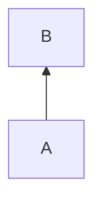
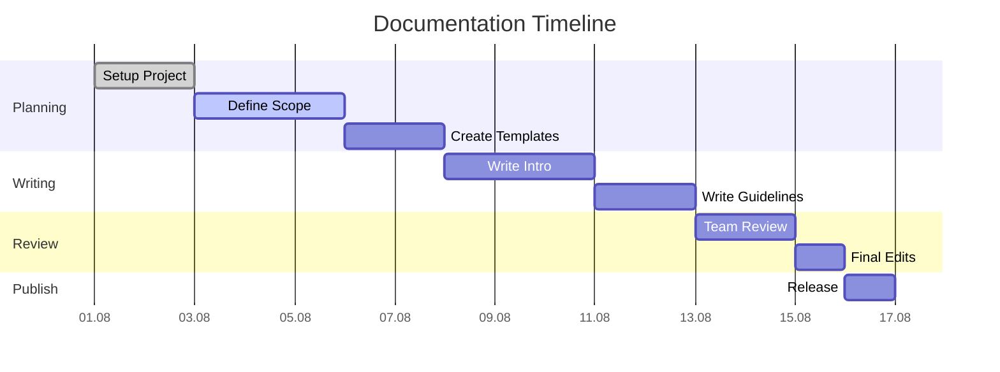

```mermaid  
graph BT
	A-->B
```

```mermaid
gantt
    title Documentation Timeline
    dateFormat  YYYY-MM-DD
    axisFormat  %d.%m

    section Planning
    Setup Project          :done,    proj1, 2025-08-01, 2d
    Define Scope           :active,  proj2, 2025-08-03, 3d
    Create Templates       :         proj3, after proj2, 2d

    section Writing
    Write Intro            :         write1, after proj3, 3d
    Write Guidelines       :         write2, after write1, 2d

    section Review
    Team Review            :         review1, after write2, 2d
    Final Edits            :         review2, after review1, 1d

    section Publish
    Release                :         release1, after review2, 1d
```
